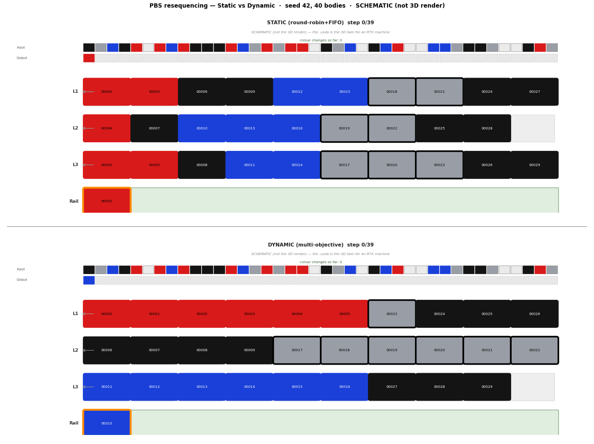
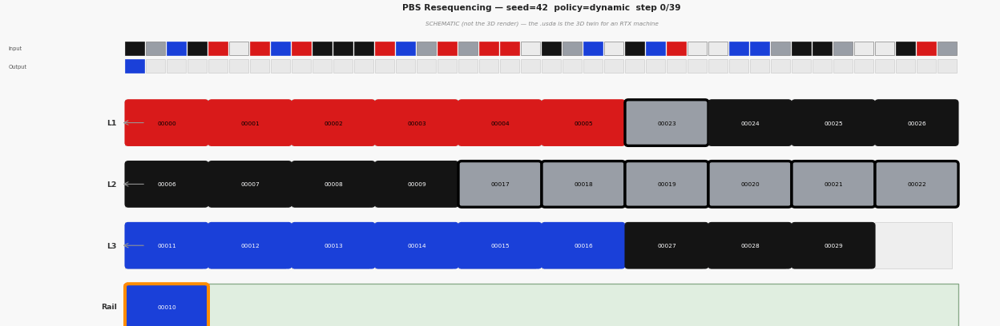

# resequence-twin-lab — Automotive PBS Resequencing PoC

> **합성 시뮬레이션 기반 PoC.** 실설비·실데이터 없음. 개인 학습용 프로젝트. KPI는 **정적 대비 상대
> 델타로만** 제시. 커머디티 레이어는 검증된 OSS(SimPy·Eclipse Ditto·Kafka·Prometheus/Grafana) 위에
> 올리고, **직접 구현은 PBS 다목적 서열 재시퀀싱 정책 + falsifiable 벤치 + 어드바이저리 에이전트
> 통합**에 집중.

A synthetic-simulation PoC of automotive **Painted-Body-Store (PBS) resequencing**: it
reconstructs live PBS buffer state, benchmarks a multi-objective dynamic sequencing policy against a
static baseline (relative deltas only, with a fix-toggle causality proof), and exposes a **read-only
advisory MCP agent** (Claude host + local RAG) that explains release decisions and forecasts
sequence-scramble risk. Polyglot: **Kotlin/Spring** for the control logic and benchmark, **Python** for
simulation and the agent.

---

## The scenario — why PBS

The **Painted Body Store** is a buffer of FIFO lanes between the **paint shop** (which wants long
same-colour batches to cut colour-change cost) and **assembly** (which needs a JIS / option-levelled
order). These goals conflict; the PBS **resequences** bodies between them. This is an automotive-
specific decoupling problem and is modelled on a **real, published, deployed** algorithm — Ford
Saarlouis car resequencing (arXiv:2507.17422), see [`research/`](research/README.md).

> The project was originally scaffolded around a semiconductor-OHT routing scenario; it was
> deliberately **re-anchored to automotive PBS** so the synthetic model genuinely fits a
> car plant. The legacy OHT routing/deadlock code is quarantined under `legacy-oht/` (see
> ADR-001, superseded).

---

## Architecture

```
[SimPy paint-stream gen] → colour-batched bodies (seeded) → [Kafka] → [PBS twin state]
 (colour/model/options/dueDateSeq)                                        │
                                                                          ▼
        ┌───────────── [Control Service (Kotlin/Spring) — direct impl] ─────────────┐
        │ PBS state → SequencingPolicy:                                             │
        │   assignLane(body)  +  selectRelease(state)                              │
        │   · static (round-robin + FIFO-by-due-date)  — baseline                  │
        │   · dynamic (multi-objective: colour 4.0 / due-date 3.0 / option 2.0,    │
        │              + overdue hard override)        — the differentiator        │
        └───────┬───────────────────────────┬───────────────────────┬─────────────┘
                ▼                           ▼                       ▼
      [bench: relative KPI]       [obs: Prometheus/Grafana]   [advisory REST: read-only GET]
      colour-changes·batch·         (actuator/prometheus)      /api/kpi · /api/explain/release
      due-date·throughput·util                                 /api/predict/scramble
      static vs dynamic                                                │
      (seeded · fix-toggle)                          [agent (Python): MCP read-only + local RAG]
                                                     get_kpi · explain_release · predict_scramble
                                                     search_docs (BM25 over ADR-002 + KPI glossary)
                                                     → consumed by Claude (MCP host)
```

---

## Visual demo (headless CPU schematic — no GPU/Omniverse)

> **SCHEMATIC, not a 3D render.** These GIFs are rendered by the `viz/` headless matplotlib
> renderer from `GET /api/trajectory` data — a no-GPU fallback. The `.usda` export is the actual 3D
> twin (viewable in usdview/Blender/Omniverse on an RTX machine). All data is **synthetic**.

**Static vs dynamic resequencing** (seed 42, 40 bodies) — the dynamic multi-objective policy builds
longer same-colour lane batches (note the `colour changes so far` KPI diverging) while honouring
JIS due-date order via the overdue override:



**Single live twin** — lane occupancy + input/output sequence advancing per release step:



> Regenerate with `python -m viz.compare --seed 42 --bodies 40` (comparison) and
> `python -m viz.render` (single twin) — see `viz/README.md`. GIFs are curated demo assets under
> `docs/assets/`; ad-hoc renders at the repo root stay gitignored.

---

## What's built (R1–R5 + Kotlin conversion + 3D-twin viz)

| Stage | Deliverable | Where |
|---|---|---|
| **R1** | PBS domain model (Body / Lane / PbsState) + seeded colour-batched paint-stream generator | `control/.../pbs/`, `sim/paint_stream.py`, `bench/PbsLoadGenerator` |
| **R2** | `SequencingPolicy` (assignLane + selectRelease): **static** baseline vs **dynamic** multi-objective heuristic (ADR-002) | `control/.../pbs/` |
| **R3** | Falsifiable benchmark: colour-changes / batch-length / due-date-deviation / throughput / utilisation KPIs, seeded, **fix-toggle** causality proof, multi-seed robustness | `control/.../bench/`, `PbsBenchRegressionTest` |
| **R4a** | Advisory analytics: read-only `explainRelease()` (per-candidate score breakdown) + `ScramblePredictor` (transparent heuristic forecast, ADR-003) | `control/.../pbs/` |
| **R4b** | Read-only REST surface (`/api/kpi`, `/api/explain/release`, `/api/predict/scramble`), honesty envelope, deterministic, GET-only | `control/.../api/` |
| **R4c** | Python MCP agent: 3 REST-backed tools + `search_docs` local BM25 RAG over ADR-002 + KPI glossary | `agent/` |
| **R5** | Deliverables: ADR-003 (scramble forecast) · `research/` (Ford arXiv 2507.17422 reference) · this README | `docs/adr/`, `research/` |
| **Kotlin** | `control` module converted Java → 100 % idiomatic Kotlin (lombok dropped, dead OHT harness removed) | `control/` |
| **Viz** | `GET /api/trajectory` (per-step trajectory) → `viz/` OpenUSD exporter (`.usda` 3D twin for usdview/Blender/Omniverse) **+** headless CPU schematic GIF renderer (no GPU/viewer needed) | `control/.../api/`, `viz/` |
| **S5 Drift seam** | `DriftMonitor` (scheduled, decoupled) detects ① structural config drift (capacity/block/missing-lane) and ② behavioral drift (EWMA residual on three KPI metrics); advisory `GET /api/drift`; Micrometer gauges; OPC-UA Eclipse Milo read adapters | `control/.../drift/` |
| **CP-SAT oracle** | Offline OR-Tools CP-SAT **optimality-gap oracle**: measures how far the dynamic heuristic is from the proven due-date-constrained colour optimum on small committed instances. Kotlin exports fixtures → Python solver computes the capacity-respecting K-FIFO optimum → `gap ≥ 0` regression. **Offline measurement only — not a policy swap.** | `solver/`, `control/.../bench/`, ADR-002 |

**Benchmark result (synthetic, 3 lanes × cap 10, 100 bodies, relative-to-static):**
colour-changes **−49 %** and batch-length **+89 %** — **HARD invariants** (improve on all 7
robustness seeds {1,7,42,99,100,1234,2024}); due-date deviation **≈ −10 %** as a **documented
observation** (improves on the majority of seeds, not universal — the colour weight can override JIS
order on some seeds; see ADR-002 OBS-3). The fix-toggle confirms the gain is **caused** by the
optimisation, not the harness.

**Optimality gap (offline CP-SAT oracle, synthetic, N=12 · 3 lanes × cap 1 · seeds {1,7,42,99,2024}):**
the dynamic heuristic is within **at most 2 colour-changes** of the *proven* due-date-constrained
colour optimum, and is **exactly colour-optimal (gap 0) on 3 of 5 seeds** — i.e. near-Pareto-optimal
at its own due-date level, not merely beating the static baseline. The gap is a **conservative upper
bound** (capacity-respecting relaxation) and the oracle is **offline measurement only — the heuristic
stays the production policy** (`solver/`, `research/optimality-gap.md`, ADR-002).

**Test status (all verified 2026-06-19):** Kotlin control **230 tests** green, 2 skipped (incl. the
optimality-gap exporter tests; `mvn -f control/pom.xml test`); Python agent **41** + viz **85** +
**solver 24** (OR-Tools CP-SAT oracle) + sim **85** green and fully offline (`pytest`; 1 Kafka
integration test deselected).

---

## Capability map (evidence-linked)

> Maps the engineering capabilities this PoC demonstrates to concrete artifacts in this repo. The
> numbers are this PoC's synthetic relative deltas, not production claims.

| Capability | Evidence in this repo |
|---|---|
| Multi-objective sequencing / resequencing optimisation | `DynamicSequencingPolicy` (weighted colour/due-date/option + anti-starvation override), ADR-002 |
| Falsifiable benchmarking & causal proof | `PbsBenchRegressionTest` (multi-seed HARD invariants + fix-toggle), relative-delta-only KPIs; **offline CP-SAT optimality-gap oracle** (`solver/`) proves the heuristic is within ≤2 colour-changes of the optimum (gap 0 on 3/5 seeds) — neutralizes the "weak baseline" critique |
| Digital-twin state pipeline (sim → stream → twin) | SimPy generator → Kafka → Eclipse Ditto idempotent projection (`ingest/DittoProjector`) |
| Observability | Spring Actuator `/prometheus` + Prometheus/Grafana stack |
| Agentic AI / MCP / RAG (read-only, explainable) | `agent/` FastMCP server: `explain_release`/`predict_scramble`/`get_kpi` + local BM25 `search_docs` |
| Explainable, upgrade-ready forecasting ("MLOps-adjacent") | `ScramblePredictor` transparent heuristic + documented learned-model upgrade path (ADR-003) |
| 3D digital-twin visualization (OpenUSD) | `GET /api/trajectory` → `viz/` OpenUSD exporter (`.usda`, viewable in usdview/Blender/Omniverse) + headless CPU schematic GIF (no-GPU fallback) |
| Polyglot engineering (Kotlin + Python) | Kotlin/Spring control & bench; Python sim, agent & viz |
| Sim–real drift detection (advisory, no write-back) | `DriftMonitor`: config structural diff + EWMA behavioral residual; `GET /api/drift`; Micrometer gauges; OPC-UA Eclipse Milo read adapters (Security=None/anonymous PoC) |
| Honest engineering discipline | relative-delta KPIs, synthetic labels everywhere, OSS-vs-direct boundary, superseded-scenario quarantine |

---

## Stack (build-vs-OSS)

| Layer | Tool | Note |
|---|---|---|
| Simulation | **SimPy** (Python) + Kotlin seeded `PbsLoadGenerator` | Synthetic — no real equipment/data |
| Twin state | **Eclipse Ditto** | OSS; direct impl = normalised-event mapping + idempotent projection |
| Streaming | **Kafka** (KRaft, single-node) | host listener `localhost:19092` |
| Sequencing solver | **greedy multi-objective heuristic** (production policy) | OR-Tools CP-SAT realized as an **offline optimality-gap oracle** (`solver/`, Python), not as the runtime policy — measures the heuristic's distance to the proven optimum (ADR-002 2026-06-19 update) |
| Scramble forecast | **transparent weighted-average heuristic** | learned model = documented upgrade path (ADR-003); NOT a trained model |
| Observability | **Prometheus + Grafana** | |
| 3D twin / visualization | **OpenUSD** (`usd-core`/pxr) export + **matplotlib** CPU schematic | `.usda` opens in usdview/Blender/Omniverse (RTX machine); CPU GIF is the no-GPU fallback. NOT Omniverse-authored (evaluated, not required) |
| Control / bench / advisory REST | **Kotlin / Spring Boot** (`server.port=8081`) | the direct-impl differentiator (100% Kotlin, JVM 21) |
| Agent | **Python + `mcp` (FastMCP) + httpx** | read-only advisory; Claude is the MCP host (no embedded LLM in the server) |
| **PBS sequencing policy + benchmark + integration** | **direct implementation** | **the differentiating contribution** |

---

## Quick start

```bash
# 1. Infra (Docker). Ports are remapped (host 8080/3000/9092 were occupied):
#    Ditto → http://localhost:18080 · Kafka → localhost:19092 · Grafana → http://localhost:3001 · Prometheus → http://localhost:9090
docker compose up -d

# 2. Control service tests (Kotlin, JVM 21+ / Maven). 230 tests (2 skipped).
mvn -f control/pom.xml test

# 3. Agent tests (Python 3.11+). 41 tests, fully offline.
cd agent && python -m pip install -e .[dev] && PYTHONIOENCODING=utf-8 python -m pytest -q

# 4. Run the control service (REST advisory API on :8081):
mvn -f control/pom.xml spring-boot:run
#    e.g. curl "http://localhost:8081/api/kpi?seed=42&bodies=100"
#         curl "http://localhost:8081/api/explain/release?seed=42&afterReleases=15"
#         curl "http://localhost:8081/api/predict/scramble?seed=42&afterReleases=15"

# 5. The MCP agent targets the control service via RESEQUENCE_TWIN_CONTROL_URL (default http://localhost:8081)
#    and is registered with an MCP host (e.g. Claude) — see agent/server.py main().
```

---

## Live streaming twin (S2–S4) — end-to-end run

> **MANUAL VERIFICATION — user-run synthetic PoC.** The steps below wire together the full
> S2–S4 streaming pipeline: Kafka → control service state machine → Prometheus scrape →
> Grafana dashboard. All data is **SYNTHETIC** (produced by the S3 Python producer, not a
> real plant floor). This runbook documents the architecture; the live render and round-trip
> is the user's to execute.

### Prerequisites

- Docker Desktop running (or Docker Engine + Compose v2 on Linux)
- JVM 21 + Maven installed (for the control service)
- Python 3.11+ with `sim/` venv (`pip install -e sim/[dev]`) for the producer

### Steps

**1. Start the Docker stack**

```bash
docker compose up -d
```

Wait for all services to become healthy. Ditto (JVM cluster formation) takes up to 2 minutes.
Check status with `docker compose ps` or `docker compose logs -f ditto-gateway`.

**2. Start the control service on the host**

```bash
mvn -f control/pom.xml spring-boot:run
```

The service starts on `:8081` and exposes `/actuator/prometheus`. Prometheus (in Docker)
scrapes it via `host.docker.internal:8081` (the `resequence-twin-control` job); `host.docker.internal` is the hostname Docker uses to reach the host machine — on native Linux the `extra_hosts: ["host.docker.internal:host-gateway"]` entry in `docker-compose.yml` is what makes that alias resolve (on Docker Desktop for Windows/Mac it is automatic). Confirm the scrape
target is UP at http://localhost:9090/targets before sending events.

**3. Run the PBS event producer**

From the `sim/` directory (or with the sim venv active):

```bash
python -m pbs_stream_producer --bootstrap localhost:19092 --topic pbs-events --bodies 100 --rate 5
```

Optional fault-injection flags (to exercise resilience counters):
- `--inject lane-block` — periodically blocks a lane
- `--inject duplicate` — re-emits duplicate event IDs
- `--inject out-of-order` — sends stale sequence numbers
- `--inject malformed` — sends structurally invalid events (exercises the rejected counter)

**4. Observe**

| What | Where |
|---|---|
| **Grafana dashboard** — `pbs_*` metrics advancing in real time | http://localhost:3001 → "PBS Live Twin" |
| **Prometheus targets** — `resequence-twin-control` job should show state=UP | http://localhost:9090/targets |
| **Ditto digital twin** — current PBS feature state (lanes / kpi / status) | `curl -H "x-ditto-pre-authenticated: nginx:ditto" http://localhost:18080/api/2/things/rtw:pbs-line` |
| **Control REST advisory** | http://localhost:8081/api/kpi, /api/explain/release, /api/predict/scramble |

### Dashboard panels

| Panel | PromQL | Note |
|---|---|---|
| Release throughput | `rate(pbs_releases_total[1m])` | bodies/s released to assembly |
| Colour-change rate | `rate(pbs_colour_changes_total[1m])` | **primary KPI** the heuristic minimises |
| Assembly output (rate) | `rate(pbs_assembly_out_total[1m])` | cumulative assembly buffer drain rate |
| Per-lane occupancy | `pbs_lane_occupancy` (legend `{{lane}}`) | one series per lane |
| Blocked lanes | `pbs_blocked_lanes` | stat panel; green=0, yellow≥1, red≥3 |
| Buffered (deferred) bodies | `pbs_buffered` | bodies awaiting lane availability |
| Resilience counters | `pbs_duplicates_total`, `pbs_out_of_order_total`, `pbs_rejected_total` | inject faults to see these rise |

---

## Drift seam (S5) — sim–real drift detection

> **Advisory PoC, no write-back, synthetic data.** The "observed" side is a perturbable in-process
> simulation, not a real plant floor. This section documents the detection **mechanism** and provides a
> runbook for exercising it both offline and with a user-run OPC-UA demo server.

### What it detects

Two independent, honestly-scoped drift layers:

**① Configuration drift** — structural diff between a baseline (captured once from the live config
source at startup) and what the source currently reports. Detects three kinds:

| `DriftKind` | Meaning |
|---|---|
| `CAPACITY_CHANGED` | A lane present in both baseline and observed reports a different capacity |
| `UNEXPECTED_BLOCK` | A lane is blocked in the observed config but not in the baseline |
| `EXPECTED_LANE_MISSING` | A lane present in the baseline is absent from the observed config |

Each finding carries an advisory `ReconciliationProposal` (machine tag + human description). These
are **never auto-applied** — the cycle is detect → propose → human approve.

**② Behavioral (residual) drift** — the twin's predicted cumulative KPI (from the live
`LivePbsProcessor` shadow, read-only `.snapshot()`) vs the observed KPI from the live telemetry
source. One `ResidualDriftDetector` per metric (releases / colourChanges / assemblyOut), running an
EWMA-smoothed residual; reports `breached=true` when `|ewma| > residualThreshold`.

**③ Intentionally out of scope:** program-semantic diff between the twin's sequencing logic and a
real PLC program, and any form of auto write-back / sync. This is the deliberately narrow feasible
slice: detect and surface, never act autonomously.

### Honesty stance

- **Advisory only, no write-back** — the monitor calls `processor.snapshot()` (read) and never
  re-seeds, mutates, or writes to the twin.
- **No OPC-UA writes** — the `OpcUaConfigSource` and `OpcUaTelemetrySource` adapters are read-only
  (`readConfig()` / `readKpi()` only; no `writeValue` or `write` call anywhere in the drift package).
- **Synthetic perturbation** — the `SimulatedConfigSource` and `SimulatedTelemetrySource` expose
  mutable fields for demo/test; the actual perturbation that drives drift findings is synthetic
  (not a real plant signal). The mechanism is demonstrated, not the real integration.
- **Baseline = live source capture** — the baseline is taken from one `readConfig()` snapshot at
  startup, not hand-authored. Config drift is `diff(captured_baseline, later_observed)`.
- **OPC-UA security is None/anonymous** — PoC only; not suitable for production.

### Offline demo (`pbs.drift.source=sim`, default)

No external dependencies. Start the control service and observe:

```bash
# Start the control service (port 8081)
mvn -f control/pom.xml spring-boot:run

# After startup the DriftMonitor captures a clean baseline and ticks every 1 s.
# Initially: zero config findings, zero behavioral breaches.
curl http://localhost:8081/api/drift

# To trigger a config finding, mutate the SimulatedConfigSource via its Spring bean
# (or write a test that calls simulatedConfigSource.setCapacity("L1", 5) before the next tick).
# On the next tick, /api/drift will show a CAPACITY_CHANGED finding with a reconciliation proposal.

# Micrometer gauges at the Prometheus endpoint:
curl -s http://localhost:8081/actuator/prometheus | grep pbs_drift
# pbs_drift_config_findings   — current count of structural config-drift findings
# pbs_drift_behavioral_breaches — current count of behavioral metrics in breach
```

**Config keys** (all prefixed `pbs.drift.*`):

| Key | Default | Purpose |
|---|---|---|
| `pbs.drift.enabled` | `true` | Field gate — set `false` in tests to skip scheduling |
| `pbs.drift.interval-ms` | `1000` | `@Scheduled` fixed-delay between drift ticks |
| `pbs.drift.ewma-alpha` | `0.3` | EWMA smoothing factor for residual detectors |
| `pbs.drift.residual-threshold` | `2.0` | `|ewma| > threshold` triggers a behavioral breach |
| `pbs.drift.source` | `sim` | `sim` (offline) or `opcua` (user-run OPC-UA server) |
| `pbs.drift.opcua.endpoint` | `opc.tcp://localhost:4840` | OPC-UA endpoint URL (only used when `source=opcua`) |

### OPC-UA user-run runbook (`pbs.drift.source=opcua`)

> The in-JVM `OpcUaSourcesTest` (Eclipse Milo embedded server) already proves the adapter round-trip
> with no external server — this runbook is for a richer live demo with a real OPC-UA process.

**1. Start a SYNTHETIC OPC-UA simulation server** (node-opcua, Prosys OPC-UA Simulation Server, or
similar) exposing PBS nodes in namespace index 2 with the following layout:

```
# Lane config nodes (one set per lane, e.g. L1, L2, L3):
ns=2;s=PBS/lanes/L1/capacity   → Int32   (lane capacity, e.g. 10)
ns=2;s=PBS/lanes/L1/blocked    → Boolean (true = blocked)
ns=2;s=PBS/lanes/L2/capacity   → Int32
ns=2;s=PBS/lanes/L2/blocked    → Boolean
ns=2;s=PBS/lanes/L3/capacity   → Int32
ns=2;s=PBS/lanes/L3/blocked    → Boolean

# KPI counter nodes (cumulative, monotonically non-decreasing):
ns=2;s=PBS/kpi/releases        → Int32
ns=2;s=PBS/kpi/colourChanges   → Int32
ns=2;s=PBS/kpi/assemblyOut     → Int32
```

All data is **synthetic** — values are whatever the simulation server publishes; no real plant data
is involved.

**2. Start the control service with OPC-UA source** (override via application properties or env):

```bash
mvn -f control/pom.xml spring-boot:run \
  -Dspring-boot.run.jvmArguments="\
    -Dpbs.drift.source=opcua \
    -Dpbs.drift.opcua.endpoint=opc.tcp://localhost:4840"
```

Or set in `application.properties`:
```properties
pbs.drift.source=opcua
pbs.drift.opcua.endpoint=opc.tcp://localhost:4840
```

The OPC-UA adapters connect **lazily** on the first tick — no connection is attempted at startup.
Security policy is `None` / anonymous identity (PoC; configure the server to allow anonymous access).

**3. Observe drift detection**

```bash
# Current drift report (config findings + behavioral breaches + reconciliation proposals):
curl http://localhost:8081/api/drift | python -m json.tool

# Micrometer gauges (scraped by Prometheus if the Docker stack is running):
curl -s http://localhost:8081/actuator/prometheus | grep pbs_drift

# To trigger a config finding: mutate a lane capacity or blocked flag on the OPC-UA server
# using the server's own UI or an OPC-UA write client (not this PoC — the adapters are read-only).
# On the next tick (~1 s) the DriftMonitor will detect the divergence and update /api/drift.
```

**4. Notes**

- The adapters are strictly **read-only** — they never call `writeValue` or any write operation
  on the OPC-UA server.
- If the server becomes unavailable, `DriftMonitor` logs a warning and emits a report with
  `sourceAvailable=false` without crashing or stalling the Kafka ingest path.
- The embedded `OpcUaSourcesTest` validates the full round-trip in-JVM with no Docker or external
  server; run it with `mvn -f control/pom.xml test -Dtest=OpcUaSourcesTest`.

---

## Honesty / Scope

- **Synthetic only** — SimPy-generated colour-batched streams with shuffled JIS due-dates; no live
  equipment or real sensor data.
- **KPIs are relative deltas** — dynamic vs static on the same seeded load. No absolute claims.
- **Ford Saarlouis numbers are a published reference, NOT this PoC's measurement** — arXiv:2507.17422
  reports +30 % batch / −23 % colour / −10 % due-date for a *real plant*; this PoC reports the same
  metric family as synthetic relative deltas only (see `research/`).
- **Robust vs. observed KPIs are labelled honestly** — colour-changes & batch-length are hard
  multi-seed invariants; due-date deviation is a seed-sensitive observation with the trade-off
  documented (ADR-002).
- **OSS commodity layers** — Ditto (state), Kafka (stream), Prometheus/Grafana (obs) are OSS; direct
  implementation is the sequencing policy, benchmark harness, advisory analytics, and integration.
- **Solver & forecast are honest heuristics** — greedy multi-objective sequencing (production policy)
  and a transparent forecast heuristic (learned-model upgrade path, ADR-003), neither presented as
  optimal/trained. CP-SAT (ADR-002) is realized as an **offline optimality-gap oracle** that *measures*
  the heuristic's distance to the proven optimum on small synthetic instances — it is **not** wired in
  as the runtime policy. The reported gap is a conservative upper bound (capacity-respecting relaxation);
  see `research/optimality-gap.md`.
- **Agent is advisory / read-only** — GET-only REST, never writes state; Claude (MCP host) does the
  reasoning, the server embeds no LLM call; RAG is deterministic local retrieval.
- **The paint shop is a simplified model**, not a real paint-process simulation.
- **NVIDIA Omniverse / OpenUSD was NOT used** — it appeared only as an optional/stretch visualisation
  idea in an earlier spec revision and was never built; actual visualisation is Grafana. Represent it,
  at most, as "evaluated, not adopted".
- **Drift seam is advisory and read-only** — detect → propose → human approve; **no write-back** to
  the twin or to any OPC-UA server. The "observed" config and KPI are synthetic perturbations of the
  simulation (the `SimulatedConfigSource` / `SimulatedTelemetrySource` mutators). This demonstrates
  the detection **mechanism**, not a real-plant integration. The OPC-UA adapters use
  SecurityPolicy.None / anonymous identity (PoC only). Program-semantic diff and auto-sync are
  explicitly out of scope.
- **Synthetic, non-production** — a personal learning project on synthetic data only; not affiliated
  with or endorsed by any company. External references in `research/` establish the real-world
  problem's relevance only.

---

## Limitations & future work

Stated plainly so the scope is not over-read — these are the boundaries of the PoC **as built**,
not hidden caveats.

**Scale & validation**
- **Synthetic data only.** Every KPI is a relative delta on a seeded synthetic stream; nothing is
  validated against a real plant. The Ford Saarlouis figures are a *published reference*, not a
  reproduction. → *Future:* replay anonymised real event logs and re-measure.
- **Small instances.** The benchmark runs 3 lanes × capacity 10 / 100 bodies; the CP-SAT optimality
  oracle runs only `N=12` at capacity 1. Behaviour at plant scale (tens–hundreds of lanes, thousands
  of bodies per shift) is unverified. → *Future:* scale the generator and profile throughput/latency.

**Algorithmic**
- **The production policy is a greedy heuristic, not optimal.** The optimality gap is *measured* only
  on tiny `cap=1` instances through a capacity-respecting K-FIFO relaxation, so the reported "within
  ≤2 colour-changes" is a conservative upper bound — **not** a guarantee at realistic capacity.
- **Due-date deviation is seed-sensitive,** not a hard invariant: the colour weight can override JIS
  order on some seeds (ADR-002 OBS-3). Only colour-changes and batch-length hold across all 7 seeds.
- **The scramble forecast is an unvalidated heuristic** with hand-tuned weights (0.45 / 0.35 / 0.20)
  calibrated to the benchmark buffer scale; it makes **no** accuracy claim. The learned-model upgrade
  path is documented (ADR-003) but not built.

**Systems & integration**
- **No latency/throughput SLOs.** Per-release decisions are computed, but the service is not
  benchmarked under load against real takt times.
- **Single-node infra.** Kafka (single-node KRaft) and Ditto run as single instances — no HA or
  horizontal-scaling story.
- **Drift detection is a mechanism demo,** not a real sim–real integration: the "observed" side is a
  synthetic perturbation, the OPC-UA adapters use `SecurityPolicy.None` / anonymous identity, and
  program-semantic diff and any write-back are explicitly out of scope.
- **Visualization is illustrative.** The `.usda` / CPU-schematic outputs demonstrate the authoring
  pipeline; Omniverse was evaluated, not adopted. The paint shop itself is a simplified model, not a
  real paint-process simulation.
- **The advisory agent is read-only with a small RAG corpus** (ADR-002 + KPI glossary); there is no
  LLM-output evaluation harness.
