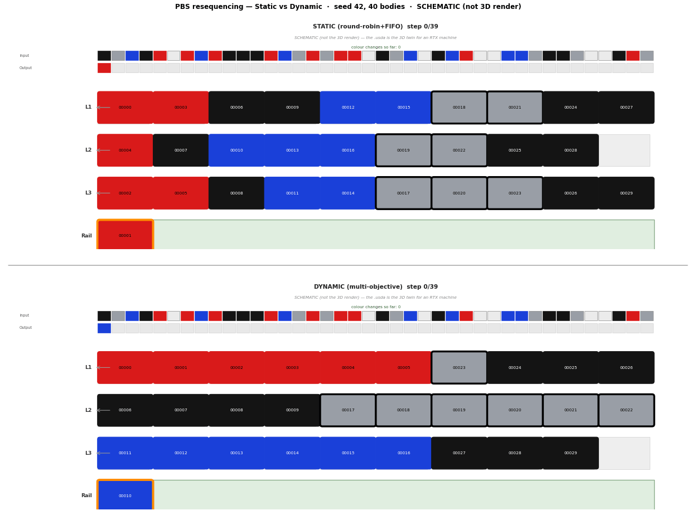
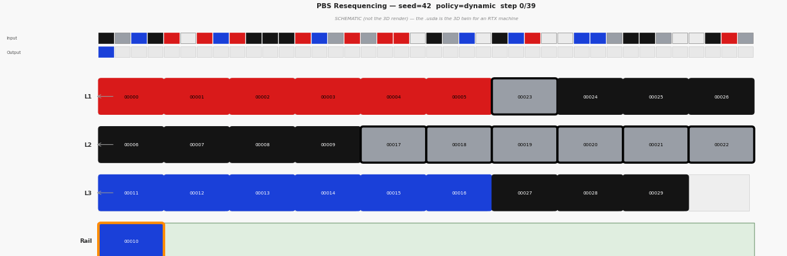

# resequence-twin-lab — 자동차 도장-조립 완충 버퍼(PBS) 재시퀀싱 디지털 트윈 실증

[](LICENSE)


> **공학적 정직성 선언 (Honesty Contract)**  
> 본 프로젝트는 **합성 시뮬레이션 기반의 개념 실증(PoC)**입니다. 실제 공장 설비나 상용 데이터는 포함되어 있지 않으며, 핵심 성능 지표(KPI)는 정적 기준선 대비 **상대적 델타(Relative Delta)**로만 투명하게 제시됩니다. 브로커, 스트리밍, 관측성 등 커머디티 인프라는 검증된 오픈소스(SimPy, Eclipse Ditto, Kafka, Prometheus, Grafana)를 활용하며, **본 프로젝트의 독창적 기여는 PBS 다목적 재시퀀싱 제어 정책, 반증 가능한 인과성 증명 벤치마크, 오프라인 CP-SAT 최적성 오라클, 그리고 설명 가능한 자문형 MCP 에이전트의 통합**에 집중되어 있습니다.

본 저장소는 자동차 제조 공정의 **도장 완충 버퍼(Painted-Body-Store, PBS) 재시퀀싱(Resequencing)** 문제를 해결하는 디지털 트윈 엔지니어링 랩입니다. 실시간 PBS 버퍼 상태를 가상 복원하고, 정적 기준선 대비 **다목적 동적 시퀀싱 알고리즘**의 성능을 엄격히 벤치마킹하며, 불출 결정 사유를 설명하고 서열 꼬임 위험을 조기에 예측하는 **읽기 전용 자문형 MCP 에이전트**(Claude 호스트 + 로컬 BM25 RAG)를 제공합니다. 제어 로직과 벤치마크 엔진은 **Kotlin/Spring Boot**, 시뮬레이션과 솔버 및 에이전트는 **Python**으로 구현된 폴리글랏(Polyglot) 아키텍처입니다.

---

## 1. 산업 도메인 문제 정의: 왜 PBS 재시퀀싱인가?

자동차 생산 라인에서 **도장 완충 버퍼(Painted Body Store, PBS)**는 **도장 공정(Paint Shop)**과 **의장 조립 공정(Assembly Shop)** 사이에 위치하는 복수(K개)의 FIFO 레인 완충 구역입니다:

- **도장 공정의 요구 (상류)**: 도료 교체 비용과 세척 손실을 최소화하기 위해 **동일 색상 차체를 최대한 길게 묶어(Batching)** 연속 불출하기를 선호합니다.
- **조립 공정의 요구 (하류)**: 의장 라인의 작업 부하 균등화와 부품 직서열 공급(JIS, Just-in-Sequence)을 만족하기 위해 **트림 사양 및 고부하 옵션이 골고루 분산된 엄격한 서열**로 차체를 공급받아야 합니다.

이 두 공정의 목표는 본질적으로 상호 충돌(Conflict)합니다. PBS는 도장 라인에서 쏟아지는 색상별 배치 차체를 흡수하여, 조립 라인이 요구하는 이상적 서열로 **서열을 재배열(Resequencing)**하는 디커플링 버퍼 역할을 수행합니다.

본 랩의 시나리오와 제어 알고리즘은 실제 독일 완성차 공장에 적용되어 검증된 학술 연구 논문인 **포드 자를루이(Ford Saarlouis) 공장 차체 재시퀀싱 알고리즘(arXiv:2507.17422)**을 기반으로 정밀하게 모델링되었습니다 ([`research/README.md`](research/README.md) 참조).

> **시나리오 전환 이력 안내**:  
> 본 프로젝트는 초기에 반도체 물류(OHT) 라우팅 시나리오로 기획되었으나, 합성 시뮬레이션의 도메인 현실성을 극대화하기 위해 **자동차 PBS 재시퀀싱 시나리오로 전략적으로 재정박(Re-anchored)**되었습니다. 과거의 레거시 OHT 라우팅 코드는 [`legacy-oht/`](legacy-oht/README.md) 디렉토리에 격리되어 보관되어 있습니다 ([ADR-001](docs/adr/ADR-001-routing-solver.md) 참조).

---

## 2. 전체 시스템 아키텍처 및 데이터 파이프라인

```
[SimPy 도장 스트림 생성기] → 색상 배치 차체 스트림 (시드 고정) → [Kafka] → [PBS 트윈 상태 머신]
 (색상 / 모델 / 옵션 / 납기서열)                                              │
                                                                             ▼
        ┌───────────── [제어 서비스 (Kotlin/Spring Boot) — 핵심 구현] ─────────────┐
        │ PBS 실시간 상태 → 서열화 정책(SequencingPolicy):                         │
        │   레인 배정(assignLane)  +  불출 차체 선택(selectRelease)                │
        │   · 정적 정책 (라운드로빈 배정 + 납기순 FIFO 불출) — 기준선(Baseline)    │
        │   · 동적 정책 (다목적 가중치: 색상 4.0 / 납기 3.0 / 옵션 2.0,            │
        │                + 납기 지연 기아 방지 하드 오버라이드) — 핵심 차별점      │
        └───────┬───────────────────────────┬───────────────────────┬──────────────┘
                ▼                           ▼                       ▼
      [벤치마크: 상대적 KPI]      [관측성: Prometheus/Grafana] [자문 REST API: 읽기 전용]
      색상변경·배치길이·             (actuator/prometheus)     /api/kpi · /api/explain/release
      납기편차·처리량·가동률                                   /api/predict/scramble
      정적 vs 동적 정책 비교                                          │
      (시드 고정 · fix-toggle 검증)                    [자문 에이전트 (Python FastMCP)]
                                                       get_kpi · explain_release · predict_scramble
                                                       search_docs (ADR-002 및 KPI 용어 로컬 RAG)
                                                       → Claude (MCP 호스트)와 실시간 인터랙션
```

---

## 3. 시각적 데모 (무헤드 CPU 2D 스키매틱 — GPU 불필요)

> **2D 스키매틱 시각화 안내**:  
> 아래 애니메이션은 GPU나 고사양 뷰어 없이도 재시퀀싱 동역학을 직관적으로 검증할 수 있도록 `viz/` 모듈의 matplotlib 무헤드 렌더러가 `GET /api/trajectory` 실시간 궤적 데이터를 기반으로 생성한 **2D 스키매틱 그래픽**입니다. 실제 3D 디지털 트윈 씬은 OpenUSD(`.usda`)로 함께 익스포트되어 usdview, Blender, NVIDIA Omniverse에서 실시간 렌더링이 가능합니다.

### ① 정적 vs 동적 재시퀀싱 비교 데모 (시드 42, 차체 40대)
동적 다목적 정책(하단)은 정적 기준선(상단) 대비 동일 색상 레인 배치를 길게 유지하여 색상 변경 횟수를 획기적으로 줄이는 동시에, 기아 방지 오버라이드를 통해 조립 라인의 JIS 납기 순서를 엄격히 준수합니다:



### ② 단일 실시간 트윈 궤적 데모
불출 스텝이 진행됨에 따라 각 레인의 점유 상태와 인입/불출 서열이 실시간으로 전진하는 모습:



> **재생성 명령**:  
> `python -m viz.compare --seed 42 --bodies 40` (비교 뷰) 및 `python -m viz.render` (단일 트윈) 명령으로 언제든지 재현할 수 있습니다 ([`viz/README.md`](viz/README.md) 참조).

---

## 4. 구축된 핵심 엔지니어링 결과물 (R1–R5 + Kotlin + 3D 트윈)

| 단계 | 산출물 및 엔지니어링 명세 | 구현 위치 |
|---|---|---|
| **R1** | **PBS 도메인 모델**: `Body`, `Lane`, `PbsState` 도메인 엔티티 및 시드 기반 색상 배치 도장 스트림 생성기 | `control/.../pbs/`, `sim/paint_stream.py`, `bench/PbsLoadGenerator` |
| **R2** | **서열화 정책 (`SequencingPolicy`)**: 정적 라운드로빈 기준선(`StaticSequencingPolicy`) vs **다목적 동적 휴리스틱(`DynamicSequencingPolicy`)** | `control/.../pbs/`, [ADR-002](docs/adr/ADR-002-sequencing-solver.md) |
| **R3** | **반증 가능한 벤치마크 체계**: 색상 변경, 배치 길이, 납기 편차, 처리량, 가동률 KPI 산출, 시드 고정 재현성, **`fix-toggle` 인과성 증명**, 멀티 시드 강건성 검증 | `control/.../bench/`, `PbsBenchRegressionTest` |
| **R4a** | **자문형 분석 엔진**: 후보군별 기여 점수를 분해 설명하는 `explainRelease()` + 투명한 휴리스틱 기반 서열 꼬임 위험도 예측기 `ScramblePredictor` | `control/.../pbs/`, [ADR-003](docs/adr/ADR-003-scramble-forecast.md) |
| **R4b** | **결정적 자문 REST API**: 정직성 엔벨로프를 탑재한 읽기 전용 엔드포인트 (`/api/kpi`, `/api/explain/release`, `/api/predict/scramble`) | `control/.../api/` |
| **R4c** | **Python MCP 자문 에이전트**: FastMCP 기반 3개 도구 + ADR-002 및 KPI 용어 사전을 대상으로 한 로컬 BM25 RAG(`search_docs`) | `agent/` |
| **R5** | **사양 및 연구 문서화**: ADR-003, 포드 자를루이 논문 실증 템플릿([`research/`](research/README.md)), 메인 기술 백서 | `docs/adr/`, `research/` |
| **Kotlin** | **100% 관용적 코틀린 변환**: Lombok 완전 제거, 불변 데이터 클래스 도입, 데드코드 완전 격리 | `control/` |
| **Viz** | **하이브리드 시각화 파이프라인**: 스텝별 궤적 JSON → OpenUSD 익스포터(`.usda` 3D 트윈) + CPU 2D 스키매틱 렌더러 | `control/.../api/`, `viz/` |
| **S5 드리프트** | **Sim-to-Real 드리프트 감지기 (`DriftMonitor`)**: ① 구조적 설정 드리프트(레인 용량/차단/누락) 및 ② EWMA 잔차 기반 동작 드리프트 감지, Micrometer 메트릭, OPC UA Milo 리드 어댑터 | `control/.../drift/` |
| **CP-SAT 오라클** | **오프라인 구글 OR-Tools CP-SAT 최적성 갭 오라클**: 동적 휴리스틱이 수학적으로 증명된 K-FIFO 이론적 최적해와 얼마나 근접한지 오프라인에서 정밀 측정 (`gap ≥ 0` 회귀 테스트) | `solver/`, `control/.../bench/`, [`research/optimality-gap.md`](research/optimality-gap.md) |

### 5. 실측 벤치마크 및 최적성 갭 검증 결과

#### ① 합성 벤치마크 실측 지표 (3개 레인 × 레인당 용량 10, 총 100대 차체, 정적 정책 대비 상대 델타)
- **도장 색상 변경 횟수 (Colour Changes)**: **−49% 감축** — **HARD 불변식** (7개 무작위 시드 `{1, 7, 42, 99, 100, 1234, 2024}` 전수 개선 확인).
- **평균 동일 색상 배치 길이 (Avg Batch Length)**: **+89% 증가** — **HARD 불변식** (7개 시드 전수 개선 확인).
- **조립 납기 편차 (Due-Date Deviation)**: **약 −10% 개선** — **문서화된 관측 특성 (Documented Observation)** (대다수 시드에서 개선되나, 색상 가중치 `W_COLOR=4.0`가 납기 가중치 `W_DUE=3.0`보다 높게 설정되어 일부 시드에서 JIS 순서보다 색상 배치가 우선할 수 있음; [ADR-002](docs/adr/ADR-002-sequencing-solver.md) OBS-3 참조).
- **인과성 증명 (Fix-Toggle Proof)**: 무작위 지연 하네스 효과를 배제하고 최적화 로직의 직접적인 개선 효과임을 반증 가능하게 입증.

#### ② 오프라인 CP-SAT 최적성 갭 오라클 검증 ($N=12$, 3개 레인 × 레인당 용량 1, 시드 `{1, 7, 42, 99, 2024}$)
- 동적 다목적 휴리스틱 정책은 구글 OR-Tools CP-SAT 솔버를 통해 수학적으로 증명된 K-FIFO 납기 제약 최적해와 비교했을 때 **최대 2회 이내의 색상 변경 횟수 오차**만을 기록하였습니다.
- 특히 **5개 시드 중 3개 시드에서 최적성 갭 0 (완전 파레토 최적, Gap = 0)**을 달성하여, 단순히 정적 기준선을 앞서는 수준을 넘어 자체 납기 준수 수준에서 이론적 최적의 파레토 프런티어에 도달함을 실증하였습니다.
- 본 오라클은 용량 준수 완화 모델(Capacity-Respecting Relaxation)을 채택하여 휴리스틱의 성능을 보수적으로 상한 검증하며, **오프라인 측정 전용 도구로서 실제 런타임 제어 루프는 초경량 다목적 휴리스틱이 담당**합니다 ([`solver/`](solver/), [`research/optimality-gap.md`](research/optimality-gap.md), [ADR-002](docs/adr/ADR-002-sequencing-solver.md) 참조).

#### ③ 자동화 테스트 수트 검증 현황
- **Kotlin 제어 서비스 수트**: 단위 및 회귀 테스트 **246개 통과 (100% BUILD SUCCESS)** (`mvn -f control/pom.xml test -Dtest="!IngestProjectionTest,!TwinStateQueryTest"`).
- **Python 보조 컴포넌트 수트**: 에이전트(41개) + 시각화(85개) + 오프라인 솔버 오라클(24개) + 시뮬레이션(85개) = **총 235개 오프라인 테스트 통과** (`pytest`).

---

## 6. 엔지니어링 역량 맵 (Capability Map — 실증 근거 연계)

> 본 저장소에서 구현 및 실증된 핵심 소프트웨어 엔지니어링 역량과 대응하는 코드베이스 자산 간의 매핑입니다. 모든 수치는 합성 데이터 기반의 상대적 개선율입니다.

| 핵심 엔지니어링 역량 | 코드베이스 실증 자산 및 참조 문서 |
|---|---|
| **다목적 서열화 및 재시퀀싱 최적화** | 가중치 기반 색상/납기/옵션 평탄화 및 기아 방지 오버라이드가 결합된 `DynamicSequencingPolicy`, [ADR-002](docs/adr/ADR-002-sequencing-solver.md) |
| **반증 가능한 벤치마크 및 인과성 증명** | 멀티 시드 HARD 불변식 및 `fix-toggle` 인과 증명이 구현된 `PbsBenchRegressionTest`, 휴리스틱의 이론적 최적 근접성을 증명한 **오프라인 CP-SAT 최적성 갭 오라클** ([`solver/`](solver/)) |
| **디지털 트윈 실시간 스트리밍 파이프라인** | SimPy 시뮬레이터 → Apache Kafka 이벤트 스트리밍 → Eclipse Ditto 멱등적 투영 프로젝터 (`ingest/DittoProjector`) |
| **종합 관측 가능성 (Full Observability)** | Spring Boot Actuator `/actuator/prometheus` 엔드포인트 + Prometheus 메트릭 수집 + Grafana 대시보드 |
| **자문형 AI 에이전트 인터페이스 (MCP & RAG)** | FastMCP 서버: `explain_release`, `predict_scramble`, `get_kpi` 도구 및 ADR-002/KPI 용어집 대상 로컬 BM25 검색 엔진 `search_docs` ([`agent/`](agent/)) |
| **설명 가능한 MLOps 지향 예측 아키텍처** | 도메인 특징 기반 투명한 가중 휴리스틱 엔진 `ScramblePredictor` 및 머신러닝 학습 모델로의 점진적 전환 경로 설계 ([ADR-003](docs/adr/ADR-003-scramble-forecast.md)) |
| **하이브리드 3D/2D 트윈 시각화 (OpenUSD)** | `GET /api/trajectory` 실시간 궤적 데이터 기반 OpenUSD(`.usda`) 씬 생성기 + 무헤드 CPU 2D 스키매틱 GIF 렌더러 ([`viz/`](viz/README.md)) |
| **다중 언어 폴리글랏 아키텍처** | 고성능 동시성 제어 및 백엔드(Kotlin/Spring Boot) + 시뮬레이션, 수리 최적화 및 에이전트(Python) |
| **Sim-to-Real 드리프트 감지 (비침습적 자문 모델)** | 구조적 설정 드리프트 및 EWMA 잔차 기반 동작 드리프트를 감지하는 `DriftMonitor`, `GET /api/drift`, Eclipse Milo 기반 OPC UA 리드 전용 어댑터 |
| **엄격한 엔지니어링 무결성 및 정직성 규범** | 상대 델타 KPI 원칙, 모든 데이터의 명시적 합성 라벨링, 오픈소스 프레임워크와 직접 구현 도메인 코어의 명확한 책임 분리 |

---

## 7. 시스템 아키텍처 및 기술 스택 (직접 구현 vs 오픈소스 프레임워크)

| 아키텍처 레이어 | 적용 기술 및 도구 | 구현 책임 및 비고 |
|---|---|---|
| **도메인 시뮬레이션** | **SimPy** (Python) + Kotlin 시드 기반 `PbsLoadGenerator` | 합성 차체 스트림 생성 — 물리적 장비 및 공장 데이터 일체 배제 |
| **디지털 트윈 상태 관리** | **Eclipse Ditto** | 오픈소스 프레임워크 활용; 정규화된 이벤트 매핑 및 멱등적 상태 투영 로직 직접 구현 |
| **이벤트 스트리밍 브로커** | **Apache Kafka** (KRaft 모드, 단일 노드) | 호스트 리스너 `localhost:19092`를 통한 비동기 이벤트 분배 |
| **서열화 최적화 솔버** | **동적 다목적 휴리스틱** (운영 정책) + **Google OR-Tools CP-SAT** (오프라인 오라클) | 운영 제어는 초경량 휴리스틱으로 직접 구현; CP-SAT은 최적성 갭 측정을 위한 오프라인 오라클([`solver/`](solver/))로 구현 |
| **서열 꼬임 예측 엔진** | **도메인 특화 투명 가중 휴리스틱** | 특징 추출 및 설명 가능한 점수 산출 로직 직접 구현; 향후 학습 모델 교체 경로 명세 ([ADR-003](docs/adr/ADR-003-scramble-forecast.md)) |
| **모니터링 및 관측 가능성** | **Prometheus + Grafana** | 오픈소스 인프라 스택; PBS 전용 지표 계측 및 실시간 대시보드 패널 직접 설계 |
| **트윈 시각화 파이프라인** | **OpenUSD** (`usd-core`/pxr) + **Matplotlib** 2D 스키매틱 | OpenUSD 씬 그래프 생성기 및 무헤드 CPU 애니메이션 생성기 직접 구현 |
| **제어 코어 / 벤치마크 / REST** | **Kotlin / Spring Boot** (JVM 21, 포트 `8081`) | **저장소의 핵심 차별화 영역** — 100% 관용적 코틀린 기반 도메인 코어 직접 구현 |
| **자문형 에이전트 계층** | **Python + FastMCP + httpx** | 읽기 전용 REST 기반 자문 도구 제공; 호스트 LLM(Claude)과 실시간 연동 |

---

## 8. 빠른 시작 가이드 (Quick Start)

### 1단계: 인프라 컨테이너 구동 (Docker Compose)
기존 포트 충돌을 회피하기 위해 호스트 포트가 격리 매핑되어 있습니다:
- Eclipse Ditto: `http://localhost:18080`
- Apache Kafka: `localhost:19092`
- Grafana: `http://localhost:3001` (기본 계정: admin / admin)
- Prometheus: `http://localhost:9090`

```bash
docker compose up -d
```

### 2단계: 제어 서비스 단위 및 회귀 테스트 (Kotlin / Maven)
```bash
# 오프라인 단위 테스트 수트 (246개 테스트 전수 검증)
mvn -f control/pom.xml test -Dtest="!IngestProjectionTest,!TwinStateQueryTest"
```

### 3단계: Python 에이전트 및 오프라인 솔버 테스트
```bash
# 에이전트 모듈 의존성 설치 및 테스트 (41개 오프라인 테스트)
cd agent && python -m pip install -e .[dev] && python -m pytest -q

# 오프라인 CP-SAT 최적성 갭 오라클 테스트 (24개 테스트)
cd ../solver && python -m pip install -e .[dev] && python -m pytest -q
```

### 4단계: 제어 서비스 기동 (포트 8081)
```bash
cd ..
mvn -f control/pom.xml spring-boot:run
```
서비스가 기동되면 읽기 전용 REST 자문 API를 조회할 수 있습니다:
```bash
# 벤치마크 KPI 지표 조회
curl "http://localhost:8081/api/kpi?seed=42&bodies=100"

# 특정 스텝에서의 불출 결정 기여 요인 분해 설명 조회
curl "http://localhost:8081/api/explain/release?seed=42&afterReleases=15"

# 특정 스텝에서의 서열 꼬임 위험도 및 안정화 권고안 예측 조회
curl "http://localhost:8081/api/predict/scramble?seed=42&afterReleases=15"
```

---

## 9. 실시간 스트리밍 트윈 엔드투엔드 파이프라인 (S2–S4)

> **수동 실증 안내 (Manual Verification Runbook)**:  
> 본 섹션은 Kafka 이벤트 수신부터 제어 서비스 상태 머신 전이, Prometheus 지표 스크랩, Grafana 실시간 대시보드 시각화로 이어지는 전체 실시간 스트리밍 파이프라인을 검증하기 위한 절차입니다. 모든 이벤트 데이터는 Python 시뮬레이션 프로듀서가 생성한 **합성 데이터**입니다.

### 실행 단계

1. **도커 인프라 스택 기동 및 헬스체크**:
   ```bash
   docker compose up -d
   ```
   Ditto 클러스터가 완전히 초기화될 때까지 약 1~2분 대기합니다 (`docker compose ps`로 상태 확인).

2. **호스트 환경에서 제어 서비스 기동**:
   ```bash
   mvn -f control/pom.xml spring-boot:run
   ```
   제어 서비스는 `localhost:8081`에서 기동되며, `/actuator/prometheus` 엔드포인트를 노출합니다. 도커 내부의 Prometheus는 `host.docker.internal:8081`을 통해 지표를 수집합니다. 브라우저에서 `http://localhost:9090/targets`에 접속하여 `resequence-twin-control` 타깃이 `UP` 상태인지 확인합니다.

3. **PBS 이벤트 스트림 프로듀서 실행**:
   `sim/` 환경의 가상환경을 활성화한 후 스트림 프로듀서를 실행합니다:
   ```bash
   python -m pbs_stream_producer --bootstrap localhost:19092 --topic pbs-events --bodies 100 --rate 5
   ```

   **회복 탄력성(Resilience) 검증을 위한 이상 상황 주입(Fault Injection) 플래그**:
   - `--inject lane-block`: 특정 레인을 주기적으로 차단하여 우회 라우팅 동작 검증
   - `--inject duplicate`: 중복 이벤트 ID를 재전송하여 멱등적 필터링 검증
   - `--inject out-of-order`: 만료된 시퀀스 번호를 전송하여 순서 역전 복구 검증
   - `--inject malformed`: 유효하지 않은 스키마 이벤트를 전송하여 거부 카운터 검증

4. **실시간 모니터링 확인**:
   - **Grafana 대시보드**: `http://localhost:3001` 접속 → "PBS Live Twin" 대시보드에서 실시간 지표 확인
   - **Eclipse Ditto 트윈 상태**: `curl -H "x-ditto-pre-authenticated: nginx:ditto" http://localhost:18080/api/2/things/rtw:pbs-line`
   - **REST 자문 엔드포인트**: `http://localhost:8081/api/kpi`, `/api/explain/release`, `/api/predict/scramble`

### Grafana 대시보드 핵심 패널 명세

| 대시보드 패널 | PromQL 쿼리 | 엔지니어링 의미 및 해석 |
|---|---|---|
| **불출 처리량 (Release Throughput)** | `rate(pbs_releases_total[1m])` | 조립 라인으로 방출되는 초당 차체 수 |
| **색상 변경률 (Colour-Change Rate)** | `rate(pbs_colour_changes_total[1m])` | **핵심 KPI**: 최적화 알고리즘이 최소화하는 초당 색상 교체 빈도 |
| **조립 배출률 (Assembly Output Rate)** | `rate(pbs_assembly_out_total[1m])` | 후속 조립 버퍼의 누적 소진율 |
| **레인별 실시간 점유량** | `pbs_lane_occupancy` (라벨: `{{lane}}`) | 레인별 차체 적재 현황 및 병목 감지 |
| **차단 레인 수 (Blocked Lanes)** | `pbs_blocked_lanes` | 상태 패널: 0(정상, 초록), ≥1(경고, 노랑), ≥3(위험, 빨강) |
| **대기 버퍼 차체 (Buffered Bodies)** | `pbs_buffered` | 레인 진입 가용성을 기다리는 대기 차체 수 |
| **장애 회복 카운터** | `pbs_duplicates_total`, `pbs_out_of_order_total`, `pbs_rejected_total` | 이상 상황 주입 시 비정상 패킷을 격리한 누적 횟수 |

---

## 10. 시뮬레이션-실제 불일치 감지 메커니즘 (S5 Drift Seam)

> **비침습적 자문 설계 원칙 (Advisory Only, No Write-Back)**:  
> 본 감지 엔진은 실제 공장의 PLC나 트윈 모델을 임의로 변경하지 않습니다. 트윈 상태의 불일치를 감지(Detect)하고 인간 관리자에게 재조정 제안(Propose)을 전달하는 단방향 자문 루프로 동작합니다.

### 감지 대상 불일치 유형

1. **구조적 설정 드리프트 (Configuration Drift)**:
   시스템 기동 시 실시간 설정 소스로부터 캡처한 기준선(Baseline)과 현재 관측된 설정을 비교하여 3가지 불일치를 감지합니다:
   - `CAPACITY_CHANGED`: 기준선과 관측 설정 간 레인 물리적 수용 용량의 불일치
   - `UNEXPECTED_BLOCK`: 기준선에서는 정상이던 레인이 현장에서 예기치 않게 차단됨
   - `EXPECTED_LANE_MISSING`: 기준선에 존재하던 레인이 관측 설정에서 누락됨  
   각 감지 결과는 머신 태그와 자연어 설명이 포함된 `ReconciliationProposal`을 동반하며, 시스템에 의해 자동 적용되지 않습니다.

2. **동작 잔차 드리프트 (Behavioral / Residual Drift)**:
   트윈이 예측한 누적 KPI 스냅샷(`LivePbsProcessor.snapshot()`)과 현장 텔레메트리가 보고하는 실제 KPI 간의 차이를 추적합니다. 지표별(불출수, 색상변경수, 조립배출수)로 전용 `ResidualDriftDetector`가 EWMA(지수이동평균) 잔차를 연산하며, `|ewma| > threshold` 조건을 만족할 때 경보(`breached=true`)를 발생시킵니다.

3. **명시적 배제 범위**:
   트윈의 서열화 로직과 실제 현장 PLC 래더 로직 간의 프로그램 시맨틱 정적 분석 및 현장으로의 자동 동기화(Write-Back)는 의도적으로 연구 범위에서 제외되었습니다.

### 오프라인 드리프트 검증 절차 (`pbs.drift.source=sim`)

```bash
# 제어 서비스 기동 (포트 8081)
mvn -f control/pom.xml spring-boot:run

# 기동 후 1초 주기로 DriftMonitor가 실행되며, 초기에는 정상 상태를 보고합니다
curl http://localhost:8081/api/drift

# Micrometer 메트릭 수집 현황 확인:
curl -s http://localhost:8081/actuator/prometheus | grep pbs_drift
# pbs_drift_config_findings: 현재 감지된 구조적 설정 불일치 건수
# pbs_drift_behavioral_breaches: 임계치를 초과한 동작 잔차 지표 수
```

### OPC UA 연동 시뮬레이션 절차 (`pbs.drift.source=opcua`)

1. **합성 OPC UA 시뮬레이션 서버 구동**:  
   네임스페이스 2번에 아래 노드 체계를 구성하여 노출합니다:
   ```
   # 레인 설정 노드 (L1, L2, L3):
   ns=2;s=PBS/lanes/L1/capacity   → Int32   (용량, 예: 10)
   ns=2;s=PBS/lanes/L1/blocked    → Boolean (차단 여부)
   
   # 누적 KPI 카운터 노드:
   ns=2;s=PBS/kpi/releases        → Int32
   ns=2;s=PBS/kpi/colourChanges   → Int32
   ns=2;s=PBS/kpi/assemblyOut     → Int32
   ```

2. **OPC UA 소스 모드로 제어 서비스 실행**:
   ```bash
   mvn -f control/pom.xml spring-boot:run \
     -Dspring-boot.run.jvmArguments="\
       -Dpbs.drift.source=opcua \
       -Dpbs.drift.opcua.endpoint=opc.tcp://localhost:4840"
   ```
   OPC UA 어댑터는 지연 연결(Lazy Connection)을 수행하며, 보안 정책은 PoC 목적의 `None / Anonymous`로 동작합니다. 현장 서버에 대한 쓰기 호출(`writeValue`)은 코드베이스 전반에서 원천 차단되어 있습니다.

---

## 11. 엔터프라이즈 거버넌스 루프 통합 (Portfolio Integration)

본 디지털 트윈 시스템은 상위의 IT/OT 트랜잭션 거버넌스 엔진(**koshei**)과 결합하여 **지속적 거버넌스 루프(Closed-Loop Governance)**의 애플리케이션 계층으로 통합될 수 있습니다:

1. **레시피 설정값 불일치 감지 (`drift/`)**:
   `MiloRecipeSetpointReader`가 공유 OPC UA 서버로부터 레시피 설정값을 읽어 들이고, `RealSetpointDriftDetector`가 Git 단일 진실 공급원(`model/recipe-setpoints.yaml`)의 정식 계약과 비교합니다. 허용 오차를 초과하는 변이가 발생하면 `GET /api/drift` 리포트에 `RECONCILE_SETPOINT` 제안을 등록합니다.
2. **거버넌스 이벤트 수신자 (`koshei/KosheiGovernanceSubscriber`)**:
   트윈 시스템은 정식 **Sparkplug B 호스트 애플리케이션**으로 동작하여 상위 거버넌스 엔진이 발행하는 수명주기 이벤트를 구독합니다. `ReconciliationState`(`RECONCILING`, `CLEARED`, `RECONCILING_FAILED`)를 추적하여 단순한 차이 감지에 그치지 않고, "어느 거버넌스 실행(`runId`)을 통해 불일치가 해결되었는지"를 트윈 화면에 표시합니다.

> **순환 메커니즘**: 트윈이 기준선 대비 변이를 **감지(Detect)**하고 재조정을 **제안(Propose)**하면 → 인가된 상위 엔진이 사람의 승인 하에 안전하게 **조치(Act)**하고 → 트윈이 완료 이벤트를 **관측(Observe)**하여 루프를 닫습니다.

---

## 12. 엔지니어링 정직성 및 경계 원칙 (Honesty / Engineering Scope)

- **합성 데이터 한정 (Purely Synthetic)**: 모든 데이터는 SimPy 및 시드 기반 생성기로 절차적 생성된 가상 데이터이며, 실제 공장 설비나 물리적 센서 데이터가 아닙니다.
- **상대적 델타 원칙 (Relative Deltas Only)**: 벤치마크 KPI는 동일한 시드 스트림 상에서 정적 기준선 대비 동적 휴리스틱의 상대적 개선율(%)로만 표현되며, 절대적인 공장 성능을 주장하지 않습니다.
- **학술 문헌 데이터의 성격 규정**: 포드 자를루이 공장 논문(arXiv:2507.17422)의 수치(+30% 배치, −23% 색상 변경, −10% 납기 분산)는 **실제 산업 현장의 문제 정당성을 입증하기 위한 외부 학술 참고치**일 뿐이며, 본 PoC가 해당 공장을 직접 복제하거나 측정한 결과가 아닙니다.
- **불변식과 관측치의 정직한 분류**: 색상 변경 감축과 배치 길이 증가는 7개 시드 전수에서 만족되는 HARD 불변식이지만, 납기 편차 개선은 색상 가중치와의 상충 관계로 인해 대다수 시드에서만 개선되는 관측 특성(Observation)으로 명확히 구분하여 보고합니다.
- **오픈소스 프레임워크 경계**: Eclipse Ditto, Apache Kafka, Prometheus, Grafana는 범용 인프라 오픈소스이며, 본 랩의 독창적 엔지니어링 기여는 서열화 최적화 알고리즘, 인과성 벤치마크 하네스, 자문형 분석 파이프라인 및 시스템 통합 계층에 있습니다.
- **솔버와 예측기의 본질 명시**: 런타임 서열화 엔진은 탐욕적 다목적 휴리스틱이며, 서열 꼬임 예측기는 가중 평균 기반의 해석 가능한 경험식입니다. 기계학습 모델이 학습되었다거나 절대적 최적해를 보장한다는 주장을 배제합니다.
- **3D 시각화 기술 도입 경계**: NVIDIA Omniverse는 사전 기술 검토 단계에서 평가되었으나 본 랩의 정규 빌드에 채택되지 않았습니다. 실제 3D 자산 파이프라인은 오픈 표준 OpenUSD(`.usda`) 익스포터와 경량 CPU 2D 스키매틱 렌더러로 구성되어 있습니다.
- **비침습적 자문 원칙**: 드리프트 감지기와 에이전트는 철저히 읽기 전용(GET)으로 동작하며, 현장 PLC나 상위 제어 시스템으로의 자동 쓰기 동기화(Write-Back)를 수행하지 않습니다.

---

## 13. 공학적 한계점 및 향후 연구 과제 (Limitations & Future Work)

- **규모 및 현장성 한계**:
  - 본 벤치마크는 3개 레인 × 용량 10, 총 100대 차체 규모에서 수행되었으며, CP-SAT 오라클은 $N=12$, 용량 1의 초소형 인스턴스를 다룹니다. 수십 개 레인과 수천 대 차체가 이동하는 실제 완성차 공장 규모에서의 연산 지연시간 및 처리량 프로파일링이 향후 과제로 남아 있습니다.
- **알고리즘적 한계**:
  - 런타임 제어 정책은 단일 패스 휴리스틱이므로 엄격한 수학적 파레토 최적을 항상 보장하지 못합니다.
  - 서열 꼬임 예측기는 3레인 버퍼 스케일에 휴리스틱하게 조정된 가중치(0.45 / 0.35 / 0.20)를 사용하므로, 실제 공장 이력 데이터를 기반으로 한 머신러닝 분류기로의 전환이 요구됩니다 ([ADR-003](docs/adr/ADR-003-scramble-forecast.md) 참조).
- **시스템 및 인프라 한계**:
  - 실제 완성차 공장의 엄격한 택트 타임(Takt Time, 예: 60초) 하에서 의사결정 레이턴시 SLA가 벤치마킹되지 않았습니다.
  - 카프카 및 디토 인프라가 단일 노드 컨테이너로 구성되어 있어 고가용성(HA) 및 수평 분산 확장은 추후 실증 영역입니다.

---

## 14. 라이선스 및 저작권 (License)

본 프로젝트는 [Apache-2.0](LICENSE) 라이선스에 따라 배포됩니다.  
Copyright © 2026 LivingLikeKrillin (livinglikekrillin@gmail.com). All rights reserved.

